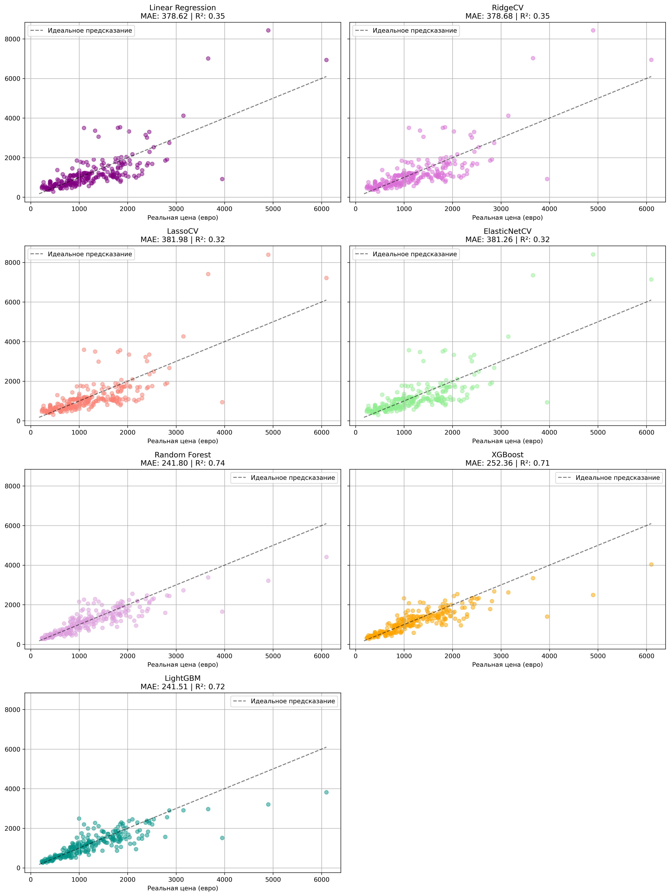

# Анализ цен на ноутбуки, используя алгоритмы регрессии

## Использованные алгоритмы:
- Линейная регрессия, здесь же Ridge/Lasso/Elastic Net
- Random Forest 
- Gradient Boosting (XGBoost/LightGBM)

## Библиотеки:
- pandas
- matplotlib
- scikit-learn
- numpy
- xgboost
- lightgbm

## Установка зависимостей

``` bash
pip install -r requirements.txt
```

В .ipynb файле содержится код, а также более подробная интерпретация полученных данных из анализа

## Датасет
- Оригинальный датасет [здесь](https://www.kaggle.com/datasets/owm4096/laptop-prices).
- В проекте 'laptop_prices.csv' находится в папке 'data'

Предсказание цены происходило по нескольким признакам: **количество оперативной памяти, ширина, высота экрана, вес, диагональ, размеры хранилищ**

## Полученные метрики:
|Метрика| Линйеная регрессия | Ridge | Lasso | Elastic Net | Random Forest | XGBoost | LightGBM |
|:------:|:------------------|:------|:------|:------------|:--------------|:--------|:---------|
| **MAE** | 313.05 | 312.92 | 313.05 | 312.79 | 234.55 | 241.76 | 241.76 |
| **MSE** | 210652.47 | 210608.27 | 210650.74 | 210570.25 | 131352.71 | 140903.40 | 140903.40 |
| **RMSE** | 458.97 | 458.92 | 458.97 | 458.88 | 362.43 | 375.37 | 375.37 |
| **R2** | 0.63 | 0.63 | 0.63 | 0.63 | **0.77** | 0.75 | 0.74 |
| **RMSE - MAE** | 145.92 | 146.00 | 145.92 | 146.09 | 127.88 | 133.62 | 133.62 |

Если кратко:
- Лучше всего справился Random Forest Regressor
- Линейная регрессия, Lasso, Ridge, Elastic Net справились хуже всего
- Скорее всего, в данных много шума, так как (RMSE - MAE) довольно большое везде

---
# Полученные графики моделей:


